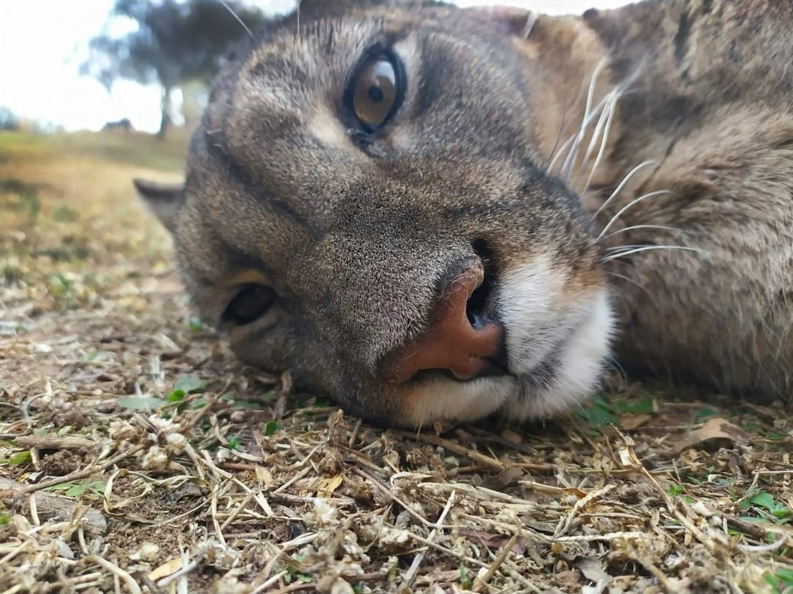

# Estanislao, el puma ciego

La reserva natural <i>Pumakawa</i>, ubicada en la provincia de Cordoba, es una ONG dedicada a la conservación ambiental de especies autóctonas. Entre los tantos animales que ésta reserva cuida, se encuentra Estanislao. Este querido amigo es un puma ciego, lo cual hace imposible su reinsercion en un habitad natural. Vamos a tener que modelar a nuestro amigo puma, de la siguiente manera.
De alguna forma, Estanislao debera recordar lo que comió, es decir, su <i>dieta</i>. Tambien tendrá que saber su nivel de hidratación que comenzara en 100. Además, debera responder los siguientes mensajes:
- Comer, agrega una comida a su dieta.
- Cantidad de veces que comió.
- Que pueda digerir, este metodo elimina la primer comida que ingirió. Esto solo es posile si ya comio, al menos, de 3 veces.
- Beber agua, se incrementará en 100 su nivel de hidratación. 
- Poder consultarle su nivel de hidratación total, este valor lo componen su nivel de hidratacion y la suma de el porcentaje de agua que tengan todas las comidas que comió. La hidratacion total tiene un máximo de 1500.
- La comida de peso máximo.
- Si es gloton, esto retorna un valor de verdad si todas las comidas que ingirio superan los 200 gr. 

## La comida de Estanis

La comida, en algunas ocasiones, es donada por gente a la cual

## Bonus

- Saber si fue un comensal ordenado, esto quiere decir que a partir de la primer comida que comió, las siguientes fueron de igual peso o menor.

